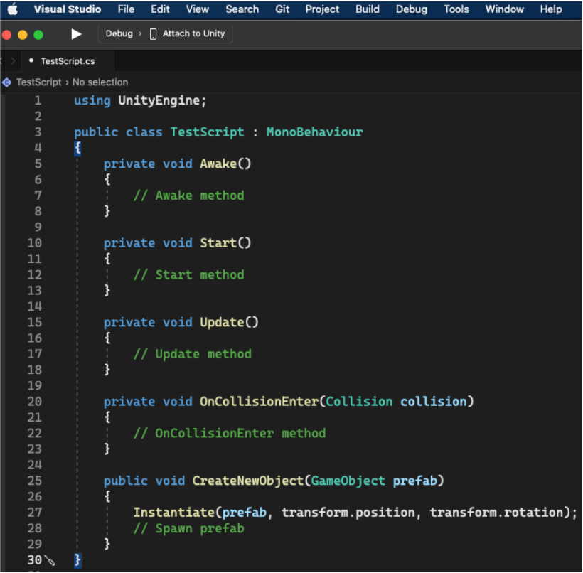

# Introduction

C# with Unity is written differently than C# outside the Unity environment because Unity provides its own set of APIs and systems specifically designed to work with the Unity engine. These APIs and systems provide access to Unity-specific features and functionality, such as the Unity Physics Engine, Unity animation system, and Unity scene management.

## Features exclusive to Unity and C#

Explore how Unity provides its classes and methods for working with GameObjects and scripting:

- Unity provides its classes and methods for working with GameObjects, such as the `GameObject` class, the `Transform` class, and the `Instantiate()` method. These classes and methods are not part of the standard C# libraries and are specific to Unity.

- Unity also provides a set of `MonoBehaviour` base classes, the base class from which every Unity script derives. These classes provide some common properties and functions that we can use to interact with the Unity engine, such as `Start()`, `Update()`, `Awake()`, `OnCollisionEnter()`, etc. These are specific to Unity and are not part of the standard C# libraries.

Unity uses a component-based architecture, where objects in the scene are made up of different components, such as `MeshRenderer`, `Collider`, `Scripts`, etc. This allows for a more modular and flexible approach to game development but also requires a slightly different way of structuring our code.

## C# syntax

C# syntax in Unity is similar to the syntax of C# in other environments. Still, some differences and additional features are specific to Unity. There are a few critical points about C# syntax in Unity. Some brief points are given below.

### Important C# syntax in Unity

Introducing Unity’s fundamental concepts requires understanding how Unity employs various mechanisms to manage scripts and GameObjects.

- Unity uses the `MonoBehaviour` class as a base class for all script components. This class provides functionality for handling input, physics, and other features specific to Unity. To create a new script component in Unity, we typically create a new class inherited from `MonoBehaviour`.

- Unity uses the `Update()` method to execute code every frame and the `Start()` method to execute code when the script component is first created. Unity automatically calls these methods and is a vital part of the game loop.

- Unity uses the concept of `components`, modular pieces of functionality that can be added to GameObjects. Components can be added to a GameObject by adding a new script component or by using built-in components, such as Mesh Renderer or Rigidbody.

- Unity uses the concept of `prefabs`, which are preconfigured GameObjects that can be easily reused and instantiated in a scene. Prefabs can be created by dragging a GameObject from the scene hierarchy into the project assets.

- Unity uses the concept of `events` to handle input and other events in the game. Events can be handled using the `UnityEvent` class or delegates, which are a feature of C#.

- Unity uses the concept of `coroutines`, which execute code over some time rather than all at once. Coroutines are a powerful feature that can create smooth animations, delays, and other effects.

## Summary

Unity’s APIs and systems, including the physics engine, animation system, and scene management system, offer users access to the engine’s specific features and functionality. Unity developers can utilize Visual Studio, which Unity includes as a powerful and versatile integrated development environment (IDE), providing access to practical and feature-rich development tools.

While C# syntax in Unity is similar to that in other environments, some additional features and concepts are specific to Unity, such as `MonoBehaviour`, `Update()`, `Start()`, `components`, `prefabs`, `events`, and `coroutines`. Understanding these concepts is essential to writing and comprehending C# scripts in Unity.
